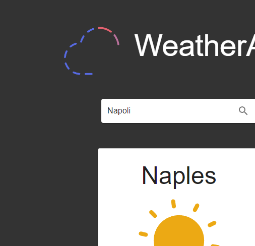

# Weather App ⛅  
WeatherApp is a web application that allows users to view weather forecasts for a specific city. The app uses React, Material-UI, and Redux for state management.

## How it works
Users can input the city name, retrieve real-time weather data, and see an animated icon representing the weather conditions, and other informations about the city weather..

## Languages
* HTML5
* CSS3
* Javascript ES6
* JSX

## What i used
* [React](https://react.dev/)
* [Node.js](https://nodejs.org/it)
* [Material-UI](https://mui.com/) as a CSS framework I have opted for.
* [Redux](https://redux.js.org/) for state management.

## Installation
First of all, you need Node.js installed.
If you don't have it, you can download it here:
[Node.js](https://nodejs.org/it/download/) 

### 1 - Clone the repository
`git clone https://github.com/R3ddy95/WeatherApp.git`

### 2 - Install the dependencies
`npm install`

### 3 - Build it!
`npm run build`

### 4 - Open in the browser
`npm start` and go to [http://localhost:3000](http://localhost:3000) to view it in your browser.

##  Try it!
Elsewhere, you can simply try it here:
[WeatherApp](https://weatherapp-bea52.web.app/)

##  License
[MIT](https://choosealicense.com/licenses/mit/)

## Contact Me
My Email: edoardo.vitagliano3@gmail.com  
You can find my Linkedin profile here: https://www.linkedin.com/in/edoardo-vitagliano-299737110/
